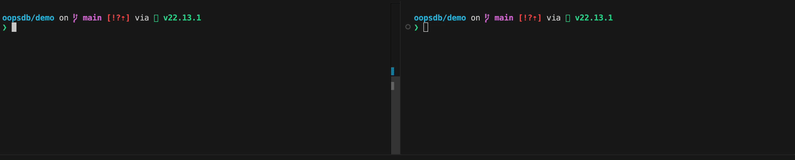

# OopsDB

**Don't let AI nuke your database.**

Auto-backup and 1-click restore for developers using Claude Code, Cursor, Windsurf, and other AI coding agents.

<p align="center">
  
</p>

---

## The Problem

You're vibing. Claude Code is cranking through tasks. Then it decides the fastest way to fix a migration is `DROP TABLE users`. Or it runs `DELETE FROM orders` without a `WHERE` clause. Or it helpfully "cleans up" your SQLite file.

Your data is gone. Your afternoon is gone. Your will to live is negotiable.

## The Fix

```bash
npm install -g oopsdb
oopsdb init      # connect your DB (Supabase, Postgres, MySQL, SQLite)
oopsdb watch     # auto-backup every 5 min
# ... AI nukes your DB ...
oopsdb restore   # pick a snapshot, roll back instantly
```

That's it. Three commands. Your data survives the AI apocalypse.

## What It Does

- **Auto-backups** on a timer (`oopsdb watch`) — set it and forget it
- **Manual snapshots** (`oopsdb snapshot`) — before risky migrations or YOLO prompts
- **Interactive restore** (`oopsdb restore`) — pick any snapshot, roll back in seconds
- **Safety snapshots** — automatically backs up your current state before restoring, so you can't oops your oops
- **Encrypted at rest** — AES-256-CBC encryption on every backup file
- **Zero cloud, zero accounts** — everything stays on your machine
- **Streaming backups** — near-zero memory footprint regardless of DB size

## Supported Databases

| Database | Backup Tool | Restore Tool |
|----------|------------|--------------|
| **Supabase** | `pg_dump` (with Supabase flags) | `psql` |
| PostgreSQL (Neon, local, other hosted) | `pg_dump` | `psql` |
| MySQL / MariaDB | `mysqldump` | `mysql` |
| SQLite | `sqlite3` | `sqlite3` |

### Supabase (first-class support)

OopsDB has dedicated Supabase support. Just paste your connection string:

```bash
oopsdb init
# → Select "Supabase"
# → Paste your connection string from Supabase Dashboard → Settings → Database
# → Done. SSL and Supabase-specific pg_dump flags are handled automatically.
```

Supabase-specific flags applied automatically: `--no-owner`, `--no-privileges`, `--no-subscriptions`, `sslmode=require`.

## Commands

```
oopsdb init                Set up your database connection
oopsdb watch               Auto-backup every 5 minutes
oopsdb watch -i 1          Auto-backup every 1 minute (paranoid mode)
oopsdb snapshot            One-time manual backup
oopsdb shield              Active query interceptor (blocks DROP/DELETE)
oopsdb restore             Interactive restore from any snapshot
oopsdb status              View backup history and stats
oopsdb secure              Immutable cloud backups
oopsdb activate <key>      Activate a Secure license
oopsdb deactivate          Deactivate your license on this machine
oopsdb license             Show current license status
oopsdb lock                Lock schema with Postgres event triggers
oopsdb unlock              Temporarily unlock schema for migrations
oopsdb clean               Remove all OopsDB data from project
```

## The Shield (Query Interceptor)

OopsDB Shield acts as a proxy between your application and your database. It monitors incoming SQL traffic and automatically takes a safety snapshot if it detects destructive commands like `DROP TABLE` or `DELETE` without a `WHERE` clause.

```bash
oopsdb shield --port 5433
# Now connect your app to port 5433 instead of the default DB port.
```

## Antigravity (PostgreSQL / Supabase)

OopsDB Antigravity provides database-level protection using native Postgres event triggers. Even if an AI agent bypasses the OopsDB proxy or connects directly to the DB, destructive DDL commands will be blocked at the database level.

- `oopsdb lock`: Creates a trigger that blocks `DROP`, `ALTER`, and `TRUNCATE` operations.
- `oopsdb unlock`: Takes a safety snapshot, drops the trigger, and allows schema modifications for 60 seconds before automatically re-locking.

## How It Works

1. `oopsdb init` walks you through connecting your database. Credentials are encrypted and saved locally in `.oopsdb/config.json`.
2. `oopsdb watch` runs the native dump tool (`pg_dump`, `mysqldump`, or `sqlite3 .backup`) at your chosen interval. Output is streamed through AES-256-CBC encryption directly to disk — memory usage stays flat even for large databases.
3. `oopsdb restore` shows your snapshots with timestamps and sizes. Pick one, confirm, and your database is rolled back. It takes a safety snapshot first, so you can always undo the undo.

## Quick Demo

Want to see OopsDB in action without touching your real database? We built a safe demo playground just for you.

1. Clone or download this repository.
2. Navigate to the `demo/` folder: `cd demo`
3. Generate the dummy database: `sqlite3 test.db < seed.sql`
4. Initialize OopsDB (it won't affect your global config because `.oopsdb` is gitignored here): `oopsdb init`
5. Try running `oopsdb shield` and firing a `DROP TABLE users` against it to watch the interceptor catch the query!

## Requirements

Your system needs the native database CLI tools:

- **PostgreSQL**: `pg_dump` + `psql`
- **MySQL**: `mysqldump` + `mysql`
- **SQLite**: `sqlite3`

OopsDB checks for these on `init` and gives install instructions if they're missing.

## Security

- Credentials encrypted at rest (AES-256-CBC, machine-local key)
- Backup files encrypted at rest (AES-256-CBC, streaming encryption)
- Nothing leaves your machine — no cloud, no telemetry, no accounts
- Add `.oopsdb/` to `.gitignore` (already in ours)

## Pricing

**Free** — Everything local. All databases, unlimited snapshots, encrypted backups. No limits, no accounts, no strings attached.

**Secure** ($9/mo) — Immutable cloud backups that even a rogue AI can't delete. Local backups are great until the AI decides to `rm -rf .oopsdb/`. `oopsdb secure` pushes encrypted snapshots to tamper-proof cloud storage with write-once retention policies. Even if your entire machine gets wiped, your backups survive.

Learn more at [oopsdb.com](https://oopsdb.com).

## License

MIT
